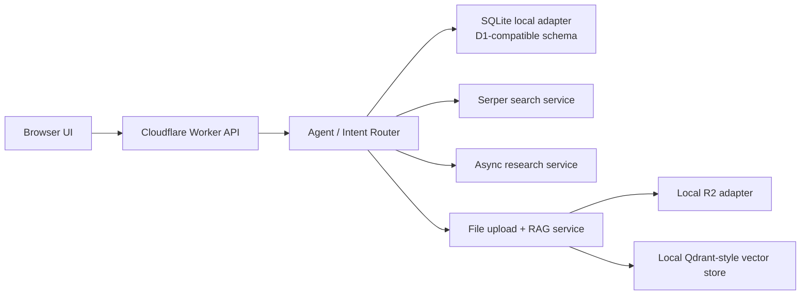

# Implementation Notes

## Current state

The repository now has a minimal but coherent MVP scaffold:

- Worker entry and route dispatch
- D1-schema-compatible SQLite persistence under `.taskmate/taskmate.db`
- Conversation agent with intent routing
- Summary plus recent-buffer context management
- Natural-language task CRUD protocol and persistent repository
- Minimal UI for chat, tasks, files, upload status, and research output
- D1 schema migration and environment variable examples
- Profile completion gating before normal task/search/research flows when user info is incomplete
- Assistant nickname sync between persistence layer and frontend UI
- Task details extraction and rendering in the workspace sidebar
- Dynamic research plan generation with running progress snapshots and structured final reports
- File rename support with synchronized Qdrant payload metadata updates
- Semantic long-term memory retrieval based on stored conversation vectors
- Image OCR support for `.png/.jpg/.jpeg` routed through the same OCR and vectorization flow as PDFs
- Simplified ToT-style recommendation section in generated research reports

## Cloudflare adapters

The code now supports two runtime modes behind the same service interfaces:

- local mode:
  - `SQLiteAppRepository`
  - local filesystem-backed R2 adapter
  - local JSON-backed Qdrant-style store
- Cloudflare mode:
  - `CloudflareD1Repository`
  - `CloudflareR2FileStore`
  - Qdrant Cloud REST-backed `QdrantStore`

`app/entry.py` selects the runtime path automatically based on whether `env.DB`, `env.FILES_BUCKET`, and `QDRANT_URL` are available.

## Architecture Diagram

## Worker Strategy

- Standard Worker remains the recommended deployment target for the MVP because chat, task CRUD, lightweight search, and file upload are all short-lived requests.
- Deep research should not stay inside a single request. The current code uses "submit + poll" so the UI can survive long-running research without blocking the request.
- Unbound Worker is not necessary for the MVP, but it can be reconsidered if the product later centralizes heavier fetch-and-summarize workloads inside one runtime instead of queueing them.

## Deployment steps

1. create D1 and R2 resources
2. bind them in `wrangler.toml`
3. set OpenRouter, Mistral OCR, Serper, and Qdrant secrets
4. run the initial D1 schema apply command
5. deploy with Wrangler

This keeps the code path identical between preview and production, with only the bindings and secrets changing.

## Context window strategy

The current `ConversationContextManager` implements the first version of the planned sliding-window design:

- Keep a recent raw-message buffer
- Compact older messages into a stored summary
- Refresh the summary once the message count crosses a threshold

This matches the TODO constraint that model context must not grow forever.

## Research design

Research mode is intentionally scaffolded as a plan-first flow:

1. Detect deep-research intent
2. Build a small plan with 3 to 5 sub-steps
3. Return a structured placeholder response

Next iteration:

- Persist `research_jobs`
- Submit async work
- Poll job status from the UI
- Render final markdown reports

The current code now implements a local async version of this flow in `ResearchService`, which matches the intended "submit + poll" interaction pattern for standard Workers.

## Queue and Durable Object assessment

- Cloudflare Queues is the cleaner production choice when research steps need durable retry, delayed execution, or backpressure control.
- Durable Objects becomes attractive if research jobs need shared mutable coordination, streamed progress, or per-job event fan-out.
- For the interview MVP, a standard Worker plus persisted `research_jobs` and polling keeps the architecture simpler while still showing that the long-running path has been separated from the request-response path.

## Sub-agent planning

The project keeps sub-agent planning at the logical level instead of introducing real distributed agents:

1. detect that the question is research-heavy
2. split it into 3 to 5 sub-questions
3. search and fetch evidence per sub-question
4. consolidate everything into one markdown report

This preserves the architecture signal from the original design while keeping the runtime simple enough for a Worker-hosted MVP.

## RAG design

The current repository includes placeholder services for:

- file parsing
- embedding generation
- local Qdrant-style storage
- retrieval assembly

The upload flow now:

1. validates file size and suffix
2. stores the raw file through the R2 abstraction
3. parses text
4. chunks text
5. embeds chunks
6. writes vectors with `user_id`, `file_id`, `chunk_index`, and `source_type`
7. retrieves by `user_id` and optional `file_id`

The next production step is to replace the local adapters with real R2 and Qdrant Cloud requests while preserving the same metadata filters.

## Planned next slice

1. Make research execution durable across worker restarts instead of relying on in-process async tasks
2. Add stronger source attribution formatting inside generated report paragraphs, not only as a trailing references section
3. Extend memory retrieval with stronger de-duplication and recency balancing
4. Add richer multimodal ingestion on top of the current text-first RAG pipeline

## Challenges and solutions

- Worker runtime constraints: long research chains are moved behind async job submission and polling instead of a single blocking request.
- Context growth: the context manager keeps a summary plus a bounded recent-message buffer to stop prompt size from growing forever.
- Local development without cloud credentials: the code uses local adapters that preserve the same interfaces and metadata contracts as the planned cloud services.
- RAG isolation: every stored chunk carries `user_id` and optional `file_id` filters so retrieval never falls back to broad unscoped search.
